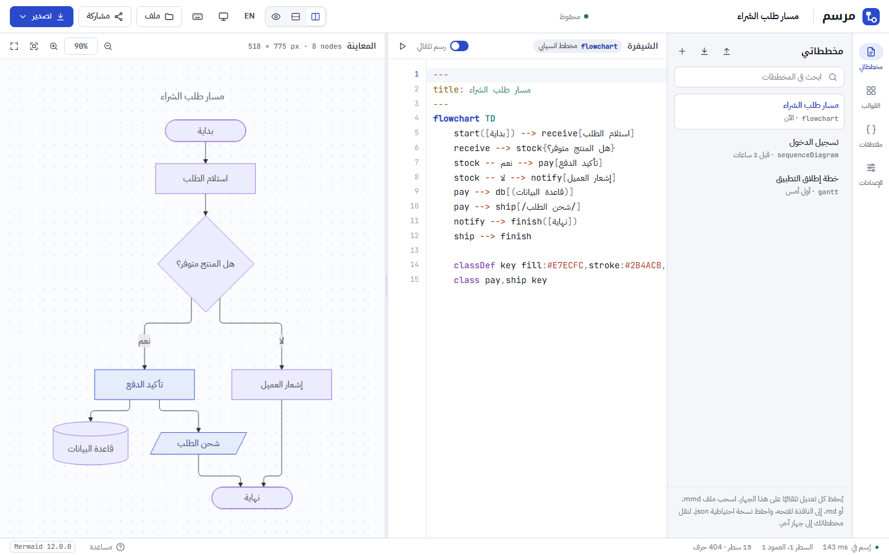

<div align="center">


# مرسم · Marsam

**محرر Mermaid احترافي بواجهة عربية، يعمل بالكامل دون اتصال بالإنترنت.**

Windows · macOS · Linux · أي متصفح

</div>

<picture>
  <source media="(prefers-color-scheme: dark)" srcset="docs/screenshot-dark.png">
  
</picture>

## التحميل

حمّل أحدث نسخة من صفحة [**Releases**](../../releases/latest):

| النظام | الملف | ملاحظة |
|---|---|---|
| Windows | `Marsam-Setup-<الإصدار>.exe` | مثبّت عادي: اختصار على سطح المكتب وقائمة ابدأ، ويفتح ملفات `.mmd` بنقرة مزدوجة |
| Windows | `Marsam-<الإصدار>-portable.exe` | ملف واحد يعمل دون تثبيت، مناسب للفلاشة |
| macOS | `Marsam-<الإصدار>-arm64.dmg` / `-x64.dmg` | ‏arm64 لأجهزة Apple Silicon، و‏x64 لأجهزة Intel |
| Linux | `Marsam-<الإصدار>-x86_64.AppImage` / `.deb` | |
| أي متصفح | `Marsam-<الإصدار>-web-offline.zip` | فك الضغط وافتح `index.html` |

> [!NOTE]
> **Windows:** البرنامج غير موقَّع رقميًا، لذلك قد تظهر رسالة «Windows protected your PC». اضغط **More info** ثم **Run anyway**.
>
> **macOS:** عند أول تشغيل انقر على التطبيق بزر الفأرة الأيمن واختر **Open**، أو نفّذ `xattr -cr /Applications/Marsam.app`.

## المزايا

- **يعمل دون إنترنت**: مكتبة Mermaid 12 والخطوط ومحرر الشيفرة كلها مضمَّنة في البرنامج.
- **عربي وإنجليزي**: بدّل لغة الواجهة واتجاهها في أي وقت من زر اللغة أو من الإعدادات، مع قوالب ومقتطفات بكلتا اللغتين.
- **ملفات حقيقية**: افتح ملفات `.mmd` واحفظ فيها مباشرة (<kbd>Ctrl</kbd>+<kbd>S</kbd>) أو «حفظ باسم»، مع تنبيه عند الإغلاق إن بقيت تعديلات غير محفوظة، وإعادة تحميل تلقائية إن تغيّر الملف من برنامج آخر.
- **تحديثات تلقائية**: يُبلغك البرنامج المثبّت بالإصدار الجديد ويثبّته بنقرة.
- **محرر شيفرة كامل**: تلوين لصياغة Mermaid، إكمال تلقائي، بحث واستبدال، تعليق الأسطر وتكرارها ونقلها، وسجل تراجع مستقل لكل مخطط.
- **معاينة حيّة**: تحريك وتكبير بالفأرة أو باللمس، وملاءمة للشاشة، ووضع ملء الشاشة. انقر على أي عقدة لتنتقل إلى سطرها في الشيفرة.
- **أخطاء واضحة**: رقم السطر الصحيح مع علامة في الهامش، ويبقى آخر رسم صالح ظاهرًا أثناء التصحيح.
- **30 قالبًا** بأمثلة عربية، منها أنواع Mermaid 12 الجديدة: هيكل السمكة، فِن، شجرة الملفات، وردلي، حالات الاستخدام، كينيفين.
- **مقتطفات** تتغيّر حسب نوع المخطط الذي تكتبه.
- **تصدير** SVG وPNG (حتى 4×) وPDF بنص قابل للبحث وMarkdown و`.mmd`، ونسخ الصورة أو الشيفرة إلى الحافظة.
- **كل السمات وأساليب الرسم**: Default وNeo وRedux وغيرها، الرسم باليد، تخطيط ELK أو Dagre، وألوان مخصّصة.
- **حفظ تلقائي** لكل المخططات، مع نسخة احتياطية `.json` لنقلها بين الأجهزة.

اضغط <kbd>?</kbd> داخل البرنامج لعرض كل اختصارات لوحة المفاتيح.

## البناء من المصدر

يتطلب [Node.js](https://nodejs.org) 22 أو أحدث.

```bash
npm install        # يثبّت الاعتماديات ويجهّز مجلد app/vendor
npm start          # يشغّل البرنامج
npm test           # اختبار آلي: الرسم والخطوط والتصدير وكل القوالب
npm run dist:win   # يبني المثبّت والنسخة المحمولة في مجلد dist
```

وللأنظمة الأخرى: `npm run dist:mac` (على macOS) و`npm run dist:linux`.

## نشر إصدار جديد

1. غيّر رقم `version` في `package.json`، مثلًا إلى `1.0.1`، ثم ابنِ البرنامج: `npm run dist:win`.
2. في صفحة Releases اضغط **Draft a new release**، وأنشئ وسمًا بالرقم نفسه مسبوقًا بحرف v، مثل `v1.0.1`.
3. أرفق هذه الملفات من مجلد `dist` كما هي دون تغيير أسمائها:
   - `Marsam-Setup-<الإصدار>.exe` و`Marsam-Setup-<الإصدار>.exe.blockmap` و`latest.yml` (هذه الثلاثة يحتاجها التحديث التلقائي)
   - `Marsam-<الإصدار>-portable.exe`
4. انشر الإصدار كإصدار عادي، لا مسودة (Draft) ولا تجريبي (Pre-release).
5. تكتشف النسخ المثبّتة الإصدار الجديد عند تشغيلها، ويثبّته مثبّت Windows بنقرة. أما النسخة المحمولة فتعرض رابط صفحة التنزيل.

لبناء نسخ macOS وLinux: من تبويب **Actions** اختر **Build & Release** ثم **Run workflow**، وحمّل الملفات من أسفل صفحة التشغيل عند انتهائه، ثم أرفقها بالإصدار.

> [!IMPORTANT]
> التحديث التلقائي يقرأ صفحة Releases مباشرة، لذلك يجب أن يكون المستودع **عامًا** (Public).

## بنية المشروع

```
app/index.html        بنية الواجهة
app/styles.css        التنسيق (فاتح وداكن، يمين ويسار)
app/i18n.js           كل نصوص الواجهة بالعربية والإنجليزية
app/content.js        القوالب والمقتطفات وأنواع المخططات باللغتين
app/app.js            منطق المحرر والمعاينة والتصدير
app/vendor/           Mermaid وCodeMirror والخطوط؛ يُنشأ تلقائيًا بعد npm install
electron/main.js      نافذة البرنامج، الملفات، PDF، التحديثات، وفتح ملفات .mmd
electron/preload.js   الجسر الآمن بين الواجهة والنظام
scripts/vendor.mjs    ينسخ الاعتماديات من node_modules إلى app/vendor
build/                أيقونة البرنامج
```

## الترخيص

© 2026 [Obsidian-Strike](https://github.com/Obsidian-Strike) — Ahmad Al-Ahmad. منشور بترخيص [MIT](LICENSE).

يضم البرنامج [Mermaid](https://github.com/mermaid-js/mermaid) و[CodeMirror 5](https://codemirror.net/5/) (MIT)، وخطوط IBM Plex Sans Arabic وNoto Kufi Arabic وJetBrains Mono (SIL OFL 1.1).

---

<details>
<summary><b>English</b></summary>

**Marsam** is an offline Mermaid diagram editor with an Arabic and English interface (switchable at any time), built on Mermaid 12 and CodeMirror 5 and packaged with Electron. It opens and saves `.mmd` files directly, exports SVG/PNG/PDF, and updates itself from GitHub Releases.

- Download installers from [Releases](../../releases/latest): Windows (installer or portable exe), macOS (dmg), Linux (AppImage/deb), or a zip that runs in any browser.
- Live preview with pan/zoom and click-to-source, syntax highlighting and autocomplete, precise error lines, 30 templates, context-aware snippets, SVG/PNG/Markdown export, and autosave with JSON backups.
- Build: `npm install`, `npm start`, `npm test`, `npm run dist:win`. Pushing a `v*` tag builds and publishes all platforms through GitHub Actions.
- © 2026 Obsidian-Strike (Ahmad Al-Ahmad). Released under the MIT License.

</details>
